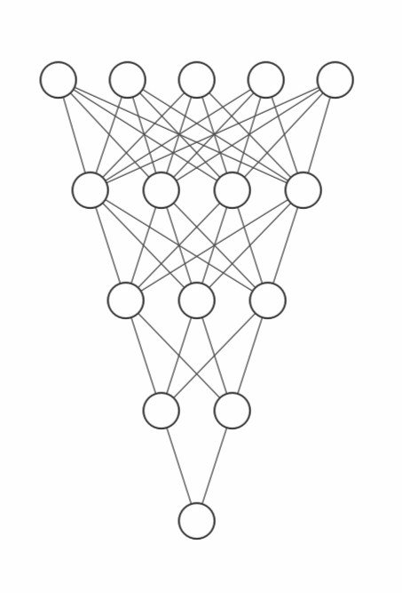
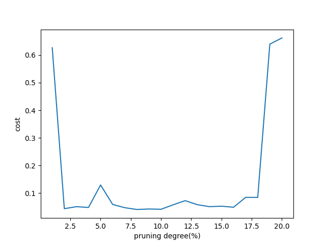
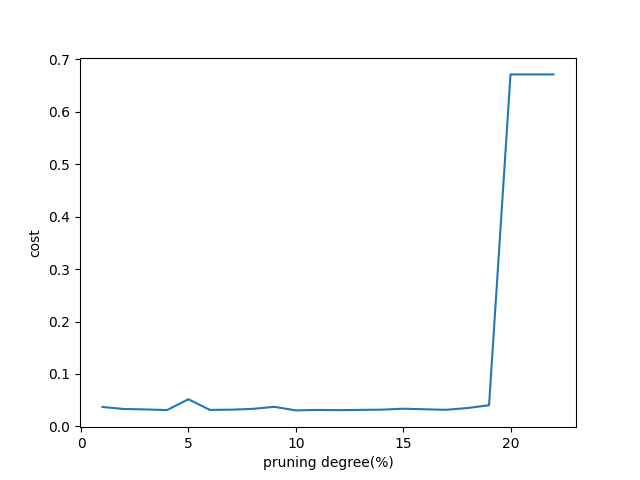

# Pruning[NISP'15]论文复现

- Paper：[[1506.02626v3] Learning both Weights and Connections for Efficient Neural Networks (arxiv.org)](https://arxiv.org/abs/1506.02626v3)

## Pseudo-code

| $Pruning\ Deep\ Neural\ Networks$                            |
| :----------------------------------------------------------- |
| $Initialization:W^{(0)}\ with\ W^{(0)}\sim N(0, sum),iter=0.$                       <br />$Hyper-parameter:\ threshold, \delta$                                                              <br />$Output:W(t).$ |
| $Train\ Connectivity$                                        |
| ***while***$\ not\ converged\ $***do***                                                                                    <br />        $W^{(t)}=W^{(t-1)}-\eta^{t}\bigtriangledown f(W^{(t-1)};x^{(t-1)});$                                             <br />        $t=t+1;$                                                                                                     <br />***end*** |
| $Prune\ Connections$                                         |
| $//\ initialize\ the\ mask\ by\ thresholding\ the\ weights.$                            <br />$Mask=1(|W|>threshold);$                                                                       <br />$W=W\cdot Mask;$ |
| $Retrain\ Weights$                                           |
| ***while*** $not\ converged$ ***do***                                                                                    <br />        $W^{(t)}=W^{(t-1)}-\eta^{t}\bigtriangledown f(W^{(t-1)};x^{(t-1)});$                                            <br />        $W^{(t)}=W^{(t)}\cdot Mask;$                                                                                <br />        $t=t+1;$                                                                                                      <br />***end*** |
| $Iterative\ Pruning$                                         |
| $threshold=threshold+\delta [iter++];$                                                          <br />***goto*** $Prune\ Connections;$ |

## Code implementation

### File Directory

- `datasets`:
  - `carvnocar.h5`: 用于网络训练参数的数据集
  - `parameters.npy`: 包含有网络训练好之后保存的参数字典数据文件
  - `data.npy`: 包含网络训练时间，训练过程中的cost值等
  - `degree_costs.npy`: 包含不同pruning度下迭代到收敛时的cost值
  - `prun_parameter`: 包含不同pruning度下训练到cost收敛时的参数
- `figure`: 一些实验中的效果图
- `photos_demo`: 用于测试网络判断效果的测试图片
- `nn_main.py`: 网络训练时的主文件
- `nn_functions.py`: 实现神经网络的主要函数
- `nn_test.py`: 用于测试训练好的神经网络
- `prun_mask.py`: 生成mask矩阵的实验
- `pruning.py`: 对原始参数进行剪枝和再训练，也是这里的主要文件
- `prun_parameters.py`: 对裁剪后的参数进行测试

### Make mask matrix and pruning

#### Set threshold

对任意矩阵，设置一个threshold，矩阵中小于这个threshold的元素就置为0(False)，大于threshold的元素置为1(True)，这样就得到了这个矩阵的mask矩阵

- code

  ```python
  import numpy as np
  a = np.array([[0,1,2,3,4],[5,6,7,8,9]])
  threshold = 4
  print("oriarray:")
  print(a)
  mask = a > threshold
  a=np.multiply(a,mask)
  print("pruning:")
  print(a)
  ```

- output

  ```python
  oriarray:
  [[0 1 2 3 4]
   [5 6 7 8 9]]
  pruning:
  [[0 0 0 0 0]
   [5 6 7 8 9]]
  ```

 对于未知、元素量大的矩阵，想要获得其mask矩阵，使用下面这个函数

```python
np.percentile(arrary, number)
```

这个函数将矩阵内的元素从小到大排列并且按照 number 索引去取得相应的分位数，number是0~100的数，比如number=50，就会将矩阵里所有

元素分为等量的两份，返回两份数字之间的中位数。number=1，就会将矩阵分为1:99的两份数，返回这两分数之间的数。也就是返回按比例分组

的阈值。

所以可以改进上面生成mask矩阵的代码：

- code

  ```python
  import numpy as np
  a = np.array([[0,1,2,3,4],[5,6,7,8,9]])
  h_threshold = 20
  print("oriarray:")
  print(a)
  threshold = np.percentile(a, h_threshold)
  mask = a > threshold
  a=np.multiply(a,mask)
  print("pruning:")
  print(a)
  ```

- output

  ```
  oriarray:
  [[0 1 2 3 4]
   [5 6 7 8 9]]
  pruning:
  [[0 0 2 3 4]
   [5 6 7 8 9]]
  ```

#### Continuous pruning

想要对矩阵进行连续的pruning，需要注意np.percentile(a, h_threshold)函数在对元素进行排列时，将所有的0都加入排列了，需要消除0对计算阈值的影响

比如，对于矩阵
$$
\begin{bmatrix}
 0&1&2&3&4\\
 5&6&7&8&9
\end{bmatrix}
$$
 ，如果对它进行20%的pruning，则会得到
$$
\begin{bmatrix}
 0&0&2&3&4\\
 5&6&7&8&9
\end{bmatrix}
$$
，但如果继续用原来的方法直接计算阈值对新生成的矩阵

进行20%的pruning，矩阵的值并不会发生变化，原因就是两个0都被放进了数组里进行计算，10个数里的20%自然就是取前两个，也就是前两个0被置为0，

结果也就不变。

为此可以定义一个函数，每次进行连续的pruning时，该函数都将矩阵中的N个0变成一个0，然后再将其余的数添加到对应数组中，也就是这个函数返回的

是只有1个0和输入向量其余非0数的数组：

- function：

  ```python
  def array0(a):
  	b=[]
  	b.append(0)
  	for i in a:
  		for j in i:
  			if j != 0:
  				b.append(j)
  	return b
  ```

- code:

  ```python
  #make mask
  import numpy as np
  a = np.array([[0,1,2,3,4],[5,6,7,8,9]])
  print("oriarray:")
  print(a)
  
  mask = a > np.percentile(a, 20)
  print(np.percentile(a,20))
  a=np.multiply(a,mask)
  print("pruning:")
  print(a)
  #直接继续进行20%的pruning，输出不变
  mask = a > np.percentile(a, 20)
  print(np.percentile(a,20))
  a=np.multiply(a,mask)
  print("pruning:")
  print(a)
  
  def array0(a):
  	b=[]
  	b.append(0)
  	for i in a:
  		for j in i:
  			if j != 0:
  				b.append(j)
  	return b
  #减去0后连续九次进行20%pruning
  b=array0(a)
  for l in range(9):
  	mask = a > np.percentile(b, 20)
  	a=np.multiply(a,mask)
  	b=array0(a)
  
  print("pruning:")
  print(a)
  ```

- output

  ```
  oriarray:
  [[0 1 2 3 4]
   [5 6 7 8 9]]
  1.8
  pruning:
  [[0 0 2 3 4]
   [5 6 7 8 9]]
  1.6
  pruning:
  [[0 0 2 3 4]
   [5 6 7 8 9]]
  pruning:
  [[0 0 0 0 0]
   [0 6 7 8 9]]
  ```

### Retrain the trained network parameters

这里使用最基础的`numpy`构建神经网络，该网络可以自定义网络层数和相应节点数，

对一个全连接层的神经网络进行参数pruning复现一下论文里的方法，下面是训练时的神经网络的隐藏层和输出层的结构示意图：

```
#指定的网络层数和节点数
layer_dims = [train_set_x.shape[0], 5, 4, 3, 2, 1]
```



这是一个简单的MLP，作用是判断输入的图片中有没有车，如果图片里有车就输出1，图片里没有车就输出0。

通过该网络训练好参数后将其保存下来，后期可以直接加载保存好的参数文件进行预测或者进行再训练。

导入需要的包

```python
from tqdm import tqdm
import numpy as np
import matplotlib.pyplot as plt
from nn_functions import *
```

载入数据集

```python
##load dataset
datas = 'datasets/carvnocar.h5'
train_set_x, train_y, test_set_x, test_y = load_files(datas)
#行标准化
train_x = train_set_x / 255
test_x = test_set_x / 255
```

载入参数文件，得到训练好的原始参数和隐藏层层数

```python
##load parameters
f_parameters = 'datasets/parameters.npy'
parameters = np.load(f_parameters, allow_pickle='TRUE').item()
L = len(parameters)//2 #隐藏层层数
```

编写判断当前参数对输入数据进行预测的准确度的函数

```python
#Print accuracy
def accuracy(parameters):
	Y_prediction_train = predict(parameters, train_x)
	Y_prediction_test = predict(parameters, test_x)
	print("Training set accuracy："  , format(100 - np.mean(np.abs(Y_prediction_train - train_y)) * 100) ,"%")
	print("Test set accuracy："  , format(100 - np.mean(np.abs(Y_prediction_test - test_y)) * 100) ,"%")
```

由于在retrain-pruning的过程对比之前网络训练的过程中多了一个pruning的过程，

所以不能直接调用之前训练网络参数的函数，需要重写前向传播函数和训练函数：

编写pruning函数：

```python
#pruning function
def prun(parameters, mask_w):
	for l in range(1,L):
		X = parameters['W'+str(l)]
		X = np.multiply(X, mask_w[l-1])
		parameters['W'+str(l)] = X
	return parameters
```

重写`forward`函数，编写`retrain`函数：
`retrain`函数通过调用`tqdm`包里的功能来实现打印训练过程进度条和实时刷新打印`cost`值

```python
#Rewrite forward propagation function
def forward_f(X, parameters):
    A = X
    caches = []
    for l in range(1, L):
        A_l = A
        A, cache = forward.activation_forward(A_l, parameters['W'+str(l)], parameters['b'+str(l)], "relu")
        caches.append(cache)
    
    AL, cache = forward.activation_forward(A, parameters['W' + str(L)], parameters['b' + str(L)], "sigmoid")
    caches.append(cache)

    return AL, caches

#Retrain function
def retrain(parameters, X, Y, learning_rate, num_iterations):
	with tqdm(total=num_iterations) as t:
		for i in range(0, num_iterations):
			AL, caches = forward_f(X, parameters)
			cost = np.squeeze(forward.cost_function(AL, Y))
			grads = backward.backward_function(AL, Y, caches)
			parameters = update_parameters(parameters, grads, learning_rate)
			parameters = prun(parameters, mask_w)
			t.set_description('Retrain %i' % i)
			t.set_postfix(cost=cost)
			t.update(1)

	return parameters, cost
```

重新载入一份参数以此进行pruning，从对伪代码进行复现

```python
#Original parameter
prun_parameter = np.load(f_parameters, allow_pickle='TRUE').item()
#Hyper parameter
h_threshold=1
delta=0.01
learning_rate=0.05
num_iterations=200

n=h_threshold
degree=[]
costs=[]
for i in range(20):
	#Make mask
	mask_w=[]
	for l in range(1,L):
		b=array0(prun_parameter['W'+str(l)])
		threshold=np.percentile(b, 100-h_threshold)
		ms=prun_parameter['W'+str(l)]<threshold
		if i>1:
			ms=np.multiply(ms,mask_w_l[l-1])
		mask_w.append(ms)
		# print("threshold "+str(l)+": "+str(threshold))
	mask_w_l=mask_w
	#Pruning parameters
	prun_parameter=prun(prun_parameter, mask_w)#parameters pruning
	degree.append(n)
	print("\nParameter pruning degree: ", round(n,2),"%")
	print("\nPruning parameters: ")
	accuracy(prun_parameter)
	#Retrain parameters
	retrain_parameters, cost = retrain(prun_parameter, train_x, train_y, learning_rate, num_iterations)
	costs.append(cost)
	print("\nPruning and retrain parameters: ")
	accuracy(retrain_parameters)
	np.save('datasets/prun_parameter/prun_parameters'+str(n)+'.npy', retrain_parameters)
	n+=h_threshold
	# h_threshold+=delta*i

degree_costs={
	'degree':degree,
	'costs':costs
}
np.save('datasets/degree_costs.npy', degree_costs)
```

这里虽然设置了超参数delta($\delta$)但是因为用来测试的网络模型很小，禁不起步进比较大的pruning，

就并没有运用到它，而是采用的每次都裁剪同样比例参数的做法层层递进。 

### Some problems

1. 对输入进行连续剪枝的时候需要注意到矩阵里 0 的增多造成的影响

   - 通过对上一次mask后的矩阵进行“消零”的处理就可以去除0对mask的影响，

     但引发的新的问题是，我连续剪枝后的矩阵对原矩阵来说并不是每一次都是同样

     的剪枝度，也就是说真实的剪枝度并不是简单的叠加的关系

2. 连续递进剪枝度进行剪枝的时候，每一次不同程度的剪枝得到的mask矩阵都是相同的，

   也就是说上一次剪枝后被置为0的数由于这一次的mask矩阵是不同的就会有一些0会在Retrain的过程中

   被重新训练回去，这相当于白忙一场

   - 只要在这一次剪枝生成mask矩阵的过程中让这一次的mask矩阵和上一次的mask矩阵按元素相乘，

     得到的这个新的mask矩阵取为本次的矩阵就可以解决这个问题。

### Complete Code

```python
from tqdm import tqdm
import numpy as np
import matplotlib.pyplot as plt
from nn_functions import *

#pruning function
def prun(parameters, mask_w):
	for l in range(1,L):
		X = parameters['W'+str(l)]
		X = np.multiply(X, mask_w[l-1])
		parameters['W'+str(l)] = X
	return parameters

#Rewrite forward propagation function
def forward_f(X, parameters):
    A = X
    caches = []
    for l in range(1, L):
        A_l = A
        A, cache = forward.activation_forward(A_l, parameters['W'+str(l)], parameters['b'+str(l)], "relu")
        caches.append(cache)
    
    AL, cache = forward.activation_forward(A, parameters['W' + str(L)], parameters['b' + str(L)], "sigmoid")
    caches.append(cache)

    return AL, caches

#Retrain function
def retrain(parameters, X, Y, learning_rate, num_iterations):
	with tqdm(total=num_iterations) as t:
		for i in range(0, num_iterations):
			AL, caches = forward_f(X, parameters)
			cost = np.squeeze(forward.cost_function(AL, Y))
			grads = backward.backward_function(AL, Y, caches)
			parameters = update_parameters(parameters, grads, learning_rate)
			parameters = prun(parameters, mask_w)
			t.set_description('Retrain %i' % i)
			t.set_postfix(cost=cost)
			t.update(1)

	return parameters, cost

#Return the retention of parameters after pruning
def parameter_retention(prun_parameter, parameters):
	N=prun_parameter['W'+str(1)]==parameters['W'+str(1)]
	n=0
	num=0
	for i in N:
		for v in i:
			num+=1
			if v==False:
				n+=1
	print("\nParameter pruning degree: ", round(n/num*100,3),"%")

#Print accuracy
def accuracy(parameters):
	Y_prediction_train = predict(parameters, train_x)
	Y_prediction_test = predict(parameters, test_x)
	print("Training set accuracy："  , format(100 - np.mean(np.abs(Y_prediction_train - train_y)) * 100) ,"%")
	print("Test set accuracy："  , format(100 - np.mean(np.abs(Y_prediction_test - test_y)) * 100) ,"%")

##load dataset
datas = 'datasets/carvnocar.h5'
train_set_x, train_y, test_set_x, test_y = load_files(datas)
train_x = train_set_x / 255
test_x = test_set_x / 255

##load parameters
f_parameters = 'datasets/parameters.npy'
parameters = np.load(f_parameters, allow_pickle='TRUE').item()
L = len(parameters)//2 

print("Original parameters: ")
accuracy(parameters)

def array0(a):
	b=[]
	b.append(0)
	for i in a:
		for j in i:
			if j != 0:
				b.append(j)
	return b

prun_parameter = np.load(f_parameters, allow_pickle='TRUE').item()

h_threshold=1
delta=0.01
learning_rate=0.05
num_iterations=200

n=h_threshold
degree=[]
costs=[]
for i in range(20):
	#Make mask
	mask_w=[]
	for l in range(1,L):
		b=array0(prun_parameter['W'+str(l)])
		threshold=np.percentile(b, 100-h_threshold)
		ms=prun_parameter['W'+str(l)]<threshold
		if i>1:
			ms=np.multiply(ms,mask_w_l[l-1])
		mask_w.append(ms)
		# print("threshold "+str(l)+": "+str(threshold))
	mask_w_l=mask_w
	#Pruning parameters
	prun_parameter=prun(prun_parameter, mask_w)#parameters pruning
	degree.append(n)
	print("\nParameter pruning degree: ", round(n,2),"%")
	print("\nPruning parameters: ")
	accuracy(prun_parameter)
	#Retrain parameters
	retrain_parameters, cost = retrain(prun_parameter, train_x, train_y, learning_rate, num_iterations)
	costs.append(cost)
	print("\nPruning and retrain parameters: ")
	accuracy(retrain_parameters)
	np.save('datasets/prun_parameter/prun_parameters'+str(n)+'.npy', retrain_parameters)
	n+=h_threshold
	# h_threshold+=delta*i

degree_costs={
	'degree':degree,
	'costs':costs
}
np.save('datasets/degree_costs.npy', degree_costs)
```

## Experimental record

不同剪枝度得到的cost：

- 每次迭代两百次，一次递进1%

  

- 每次迭代1000次，一次递进1%

  

```
Parameter pruning degree:  18 %

Pruning parameters:
Training set accuracy： 59.668508287292816 %
Test set accuracy： 63.333333333333336 %
Retrain 999: 100%|███████████████████████████████████████| 1000/1000 [00:35<00:00, 28.34it/s, cost=0.03488670820591637]

Pruning and retrain parameters:
Training set accuracy： 99.4475138121547 %
Test set accuracy： 81.66666666666667 %

Parameter pruning degree:  19 %

Pruning parameters:
Training set accuracy： 59.668508287292816 %
Test set accuracy： 61.666666666666664 %
Retrain 999: 100%|████████████████████████████████████████| 1000/1000 [00:34<00:00, 29.36it/s, cost=0.0401749698558484]

Pruning and retrain parameters:
Training set accuracy： 99.4475138121547 %
Test set accuracy： 78.33333333333333 %

Parameter pruning degree:  20 %

Pruning parameters:
Training set accuracy： 59.668508287292816 %
Test set accuracy： 61.666666666666664 %
Retrain 999: 100%|████████████████████████████████████████| 1000/1000 [00:31<00:00, 32.16it/s, cost=0.6715302795049012]

Pruning and retrain parameters:
Training set accuracy： 59.668508287292816 %
Test set accuracy： 63.333333333333336 %

Parameter pruning degree:  21 %

Pruning parameters:
Training set accuracy： 59.668508287292816 %
Test set accuracy： 61.666666666666664 %
Retrain 999: 100%|████████████████████████████████████████| 1000/1000 [00:29<00:00, 33.60it/s, cost=0.6715300536111978]

Pruning and retrain parameters:
Training set accuracy： 59.668508287292816 %
Test set accuracy： 63.333333333333336 %

Parameter pruning degree:  22 %

Pruning parameters:
Training set accuracy： 59.668508287292816 %
Test set accuracy： 61.666666666666664 %
Retrain 999: 100%|████████████████████████████████████████| 1000/1000 [00:33<00:00, 29.65it/s, cost=0.6715298271933033]

Pruning and retrain parameters:
Training set accuracy： 59.668508287292816 %
Test set accuracy： 63.333333333333336 %
```

使用第十九次剪枝后重训练得到的参数与原参数进行比对、判断：

```
Ori parameter:
Parameter pruning degree:  0.0 %
Training set accuracy： 98.89502762430939 %
Test set accuracy： 80.0 %
Pruned parameter:
Parameter pruning degree:  16.971 %
Training set accuracy： 99.4475138121547 %
Test set accuracy： 78.33333333333333 %
```

原参数对测试图片进行预测：


剪枝后：


第二十次：

```
Ori parameter:
Parameter pruning degree:  0.0 %
Training set accuracy： 98.89502762430939 %
Test set accuracy： 80.0 %
Pruned parameter:
Parameter pruning degree:  17.802 %
Training set accuracy： 59.668508287292816 %
Test set accuracy： 63.333333333333336 %
```


可见，在第二十次剪枝再训练时，cost就一直处以一个较高的状态，基本难以下降，

在此之前的剪枝再训练都可以得到一个比较好的效果。

推测是因为本次实验的网络模型本身就很小，所以其参数量也少，重要的不可消减的参数占比比较多，

如果换成网络模型更大、参数更多的网络，应该是可以更进一步的。

没有确定下来剪枝率是尚待解决的问题，目前还没有一个比较好的方案。
